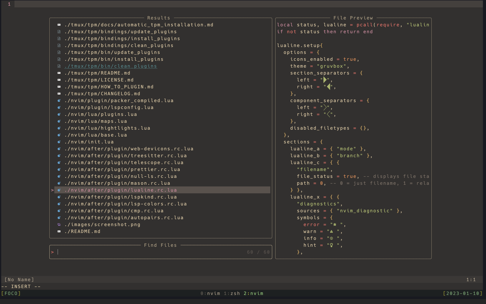

## Packages

[packer.nvim](https://github.com/wbthomason/packer.nvim): A use-package inspired plugin manager for Neovim. Uses native packages, supports Luarocks dependencies, written in Lua, allows for expressive config
[plenary.nvim](https://github.com/nvim-lua/plenary.nvim): plenary: full; complete; entire; absolute; unqualified. All the lua functions I don't want to write twice.
[mason.nvim](https://github.com/williamboman/mason.nvim): Portable package manager for Neovim that runs everywhere Neovim runs. Easily install and manage LSP servers, DAP servers, linters, and formatters.
[mason.nvim](https://github.com/williamboman/mason.nvim): Portable package manager for Neovim that runs everywhere Neovim runs. Easily install and manage LSP servers, DAP servers, linters, and formatters.
[telescope-file-browser.nvim](https://github.com/nvim-telescope/telescope-file-browser.nvim): File Browser extension for telescope.nvim
[telescope-file-browser.nvim](https://github.com/nvim-telescope/telescope-file-browser.nvim): File Browser extension for telescope.nvim
[telescope.nvim](https://github.com/nvim-telescope/telescope.nvim): Find, Filter, Preview, Pick. All lua, all the time.
[packer.nvim](https://github.com/wbthomason/packer.nvim): A use-package inspired plugin manager for Neovim. Uses native packages, supports Luarocks dependencies, written in Lua, allows for expressive config
[prettier.nvim](https://github.com/MunifTanjim/prettier.nvim): Prettier plugin for Neovim's built-in LSP client.
[lspkind-nvim](https://github.com/onsails/lspkind-nvim): undefined
[nvim-web-devicons](https://github.com/kyazdani42/nvim-web-devicons): lua `fork` of vim-web-devicons for neovim
[mason-lspconfig.nvim](https://github.com/williamboman/mason-lspconfig.nvim): Extension to mason.nvim that makes it easier to use lspconfig with mason.nvim. Strongly recommended for Windows users.
[mason-lspconfig.nvim](https://github.com/williamboman/mason-lspconfig.nvim): Extension to mason.nvim that makes it easier to use lspconfig with mason.nvim. Strongly recommended for Windows users.
[lspkind-nvim](https://github.com/onsails/lspkind-nvim): undefined
[nvim-tree.lua](https://github.com/nvim-tree/nvim-tree.lua): A file explorer tree for neovim written in lua
[nvim-tree.lua](https://github.com/nvim-tree/nvim-tree.lua): A file explorer tree for neovim written in lua
[nvim-web-devicons](https://github.com/kyazdani42/nvim-web-devicons): lua `fork` of vim-web-devicons for neovim

## Generate package list

- open `packages.lua`
- run `:so`
- `node my_nvim_packages.js`
- check file: `plugins.txt`
